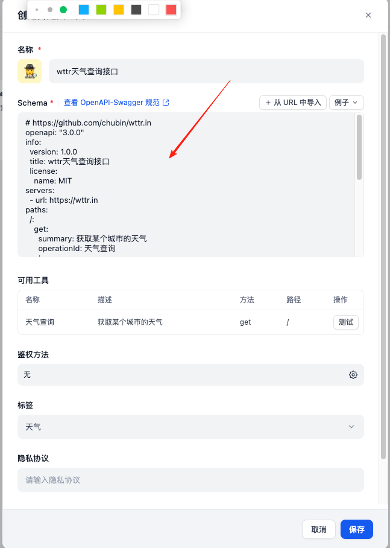

#  使用方法

* 访问自定义工具界面，地址为：${host}/tools?category=api

* 点击创建自定义工具

* 在Schema输入框中输入想要添加的接口工具对应的yml文件，工具名名称、标签、隐私协议、免责声明自行编写，如果需要鉴权的接口，填入对应的token即可，点击创建即可。

# 编写openapi调试工具

https://editor.swagger.io

# 接口说明

### cl2wm.yml

草料二维码接口

### sougou_ocr.yml

搜狗OCR接口

### wttr.yml 

[wttr天气查询接口](https://github.com/chubin/wttr.in)

